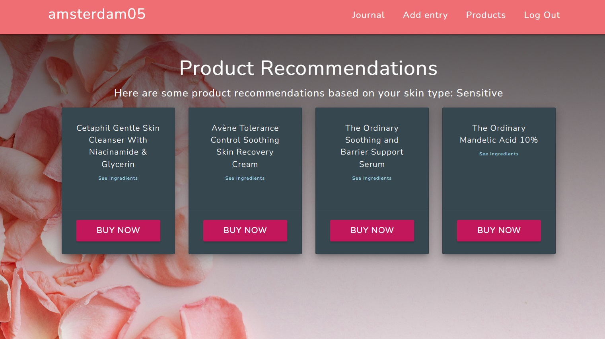
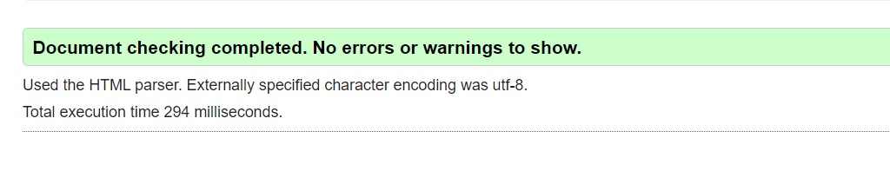

# Skincare Journal

A Skincare Journal is a straightforward app designed to help users manage their skincare routines. 

As a skincare enthusiast, I've noticed that it can be challenging to keep track of all the products in my routine, especially when some are used only a few times a week, while others are designated for specific times like morning or evening.

Initially, I had the idea of creating an app that would leverage APIs to do more than just help users track their skincare routines. My goal was to design a platform that could also offer personalized product recommendations and direct users to purchase the products they need. 
The inspiration for this project came from my passion for skincare, and I saw this as an opportunity to build something that could genuinely enhance the skincare experience for others. I wanted to combine technology with my interest in skincare to create a tool that would be both practical and enjoyable for users. 

However, I encountered challenges in finding APIs that would be suitable for my app, and that is how I decided to develop a Skincare Journal instead, leaving the door open for my initial idea. 

# The Challenge of skincare products
In today's world, skincare is not just a routine—it's a significant aspect of self-care, well-being, and confidence. With the beauty industry booming, there is an overwhelming variety of skincare products available on the market, each promising specific benefits. For skincare enthusiasts and beginners alike, navigating this sea of options can be daunting. The challenges are multifaceted:

Product Confusion: The sheer number of available products can lead to confusion. Users often struggle to remember which products to use and when, especially when managing a multi-step routine that includes cleansers, moisturizers, serums, and more.

Timing and Order: The effectiveness of skincare products can be heavily influenced by the order in which they are applied and the time of day they are used. For instance, some products are best suited for morning use, while others are more effective in the evening. Incorrect usage can lead to suboptimal results, or worse, skin irritation.

Product Incompatibility: Certain ingredients in skincare products should not be mixed due to potential adverse reactions. For example, using retinol and vitamin C together can lead to skin sensitivity. Without proper guidance, users may inadvertently combine incompatible products, reducing their efficacy or causing harm. 

# The Solution: a journal, or even better, a Skincare Journal

The Skincare Journal was developed as a direct response to these challenges. It is more than just a digital log; it’s a comprehensive tool designed to simplify and enhance the skincare experience for users. Here's how it addresses the specific problems:

Personalized Product Logging: Users can create a profile, log their skincare products, and easily track their usage. The app allows for detailed entries, where users can specify the type of product, when it is used, and for what purpose.

Routine Optimization: Based on the products logged, the Skincare Journal helps users structure a personalized skincare routine. It offers guidance on the optimal timing and order of product application, ensuring that users get the most out of their regimen.

Informed Recommendations: The app is designed to help users avoid product incompatibilities by providing clear information on which ingredients work well together and which do not. This feature is crucial for preventing adverse reactions and ensuring that the skincare routine is as effective as possible.

Sure, the UI can be improved, but I believe the base is there, it just needs some more features, which I'm going to talk about later on.

### The Problem:
1. Product Confusion: With a plethora of skincare products available, it can be overwhelming to remember what products to use.

2. Timing and Order: The effectiveness of skincare products can depend significantly on the order of application and the time of day they are used.

3. Product Incompatibility: Certain skincare ingredients should not be mixed due to potential adverse reactions or reduced efficacy.

**Target audience:**

Individuals, particularly women, who are passionate about maintaining and optimizing their skincare routines. This includes anyone interested in tracking their daily skincare habits, monitoring product usage, and improving their overall skin health through consistent and informed practices. 

**Real-World Application:**

## UX Design Process

### Wireframes and Mock-ups 
In the initial stages of development, wireframes were created using Figma to visualize the app’s layout and user flow. These wireframes served as a blueprint for the design, ensuring that the user interface was both intuitive and aesthetically pleasing.
However, I found myself changing the wireframes heavily during the development process, as I did not have a defined idea of what I wanted to achieve in terms of database.

### Design Decisions and Reasoning

The design of the Skincare Journal was guided by the principles of simplicity and user-friendliness. Each element, from the navigation to the logging forms, was designed to be straightforward and easy to use. The goal was to create an app that users could quickly integrate into their daily skincare routine without unnecessary complexity.

## Features

 Based on the logged products, the app creates customized products reccomendations tailored to the user's specific skin type. 
The app saves the user entries according to the date. A calendar might be used in the future.

**Product Logging:** 
Upon accessing the website, users have the option to log in or register with a username and password of their choice. After successfully logging in or registering, they are prompted to select their skin type from four available options.

To add a new skincare entry, users can choose the type of product (such as a cleanser, serum, moisturizer, or peeling/exfoliator), select a specific product from a list of recommendations tailored to their skin type, specify the time of day, and save the entry.

**Skincare Journal:** 
Once saved, users can view their skincare history on the Journal page, where they have the ability to view, update, and delete their entries.

Currently, the app includes a limited number of products, but given the vast selection available on the market, I am considering the potential of integrating an API to expand the product database.(haven not found suitable ones yet but working on it)

**Personalized Routine Generation:**

After selecting their skin type, users will receive personalized product suggestions on the Products page, where the recommended products will be displayed. They can also view the ingredients of each product or update their skin type if it has changed over time (such as becoming sensitive or drying out during the winter, and so on)

# MongoDB Database Structure and Data Model

The application utilizes a MongoDB database to effectively manage and store various types of data essential for delivering a personalized skincare experience to its users. The database is named Skincare_db and consists of the following collections:

1. products

The products collection stores information about various skincare products, including their names, types (e.g., cleanser, moisturizer, serum or peeling), skin type suitability (e.g., oily, dry, combination, sensitive), and ingredients.
This data model allows the application to offer personalized product recommendations based on the user’s skin type, making it a critical component for achieving the app's goal of providing tailored skincare advice.
This collection is essential for populating the product recommendations displayed to users. By associating each product with a specific skin type, the application can filter and suggest only those products that are most suitable for the user's skin, thus enhancing the user experience and increasing the relevance of the recommendations.

2. skincare_entries

The skincare_entries collection logs individual skincare routine entries made by users. Each document includes the user's name, the skincare step (e.g., cleanser, serum etc), the product used, the time of day (morning or evening), and the date and time when the entry was created.

This collection is fundamental for tracking and managing the user's skincare routine. By storing each entry separately, the app allows users to monitor their skincare habits over time, see patterns in product usage, and make informed decisions about their routine. It also supports features like viewing, editing(by deleting and adding a new entry), and deleting past entries, providing users with comprehensive control over their skincare regimen.

3. user_skintype
The user_skintype collection holds information about each user’s skin type. Each document is associated with a specific user and records their chosen skin type (e.g., oily, dry, combination, sensitive).

This collection is crucial for delivering personalized recommendations on the Products page, but also when the user is adding a new entry. By storing the user’s skin type, the app can customize the product suggestions it provides, ensuring that users receive the most appropriate advice for their unique skin needs. This personalization is a key feature of the app, making the user experience more relevant and effective.

4. users

Each collection is designed to serve a specific purpose within the application, and together, they form a cohesive data model that aligns with the core functionality of the project.

## Technologies Used

- HTML
- CSS
- Python
- Flask
- Mongo Atlas and Compass 
- Figma 
- Git and Github for version control
- Visual Studio Code
- Chrome developer tools
- Pexels for images
- Materialize

## Installation

To install the game locally, follow these steps:

1. Clone the repository using the following command:

git clone https:// https://github.com/adinabo/skincare_journal

2. Open the project folder and open home.html in your preferred browser.

## Deployment

The website was successfully deployed to GitHub. Steps to deploy it:

1. Go to the **Settings** tab in the GitHub repository.

2. Scroll down to **GitHub Pages** and click on **"Check it out here!"**

3. Make sure to choose **"main"** under **"Source"**.

4. The page will automatically refresh, showing a detailed ribbon display confirming the deployment.

The live site can be found at the following link: https:/ ####################

## Bugs

1. Users Unable to Log Back In After Logging Out

A significant issue encountered during development is that users are unable to log back into the application after they have logged out. Once a user logs out, attempting to log in again with the same credentials results in a failure, requiring the user to create a new account to regain access.
The problem stems from how the session is managed and how user authentication is handled. When a user logs out, the session is cleared, which is expected behavior. However, upon logging back in, the system does not correctly retrieve or validate the user's credentials from the database. 

This bug significantly impacts the user experience, as it effectively locks users out of their accounts once they log out. Resolving this issue is critical to ensure that users can seamlessly log in and out of the application as needed.

2. Skin Type Only Temporarily Saved in the Database
Another major issue discovered during development is that a user's selected skin type is only temporarily saved in the database. After restarting the server, the skin type appears to be deleted or lost, and the user needs to update their skin type again.

This bug also significantly affects the user experience by causing frustration and confusion. Users may believe their preferences are saved, only to find them missing later. Fixing this issue is crucial to ensuring that users can reliably set and maintain their skin type preferences across sessions.

## Manual Testing

1. User Interface (UI) Testing:

All UI elements, including buttons, forms, and links, were manually tested to ensure they function as intended across different screen sizes and devices.

2. User Experience (UX) Testing:

The overall user experience was evaluated to ensure that the app is intuitive and easy to use. Feedback was gathered from real users, and improvements were made based on their suggestions.

**Device Compatibility Test:**

The app was tested on various devices, including desktops, tablets, and smartphones, to ensure consistent performance and appearance.

Testers (friends and family) explored the app to identify any unexpected behavior or bugs.

## Automated Testing

W3C HTML Validator: HTML was validated using the W3C HTML Validator to ensure proper syntax and compliance with web standards.
CSS Validator: CSS was validated using the W3C CSS Validator to catch any errors in styling.
Google Lighthouse: The app's performance, accessibility, and best practices were evaluated using Google Lighthouse.

- WS3 HTML Testing Validator

After testing the HTML code with W3C Validator, there were no errors found.

[W3C Validator](https://validator.w3.org/)

- CSS 
After testing the CSS code with Jigsaw Validator, there were no errors found.

[CSS Validator](https://validator.w3.org/)

- JavaScript

Testing with JSLint has returned 1 warning, but is not actually a synthax error.

[Javascript testing result](https://www.jslint.com/)

- Python Linter

[Python Linter testing results](https://pep8ci.herokuapp.com/#)

## User Stories

- As a user, I want to log my skincare products so that I can keep track of my routine.
- As a user, I want personalized recommendations so that I can optimize my skincare routine.
- As a user, I want to know the ingredients in my products so I can make an informed decision.

# Future improvements